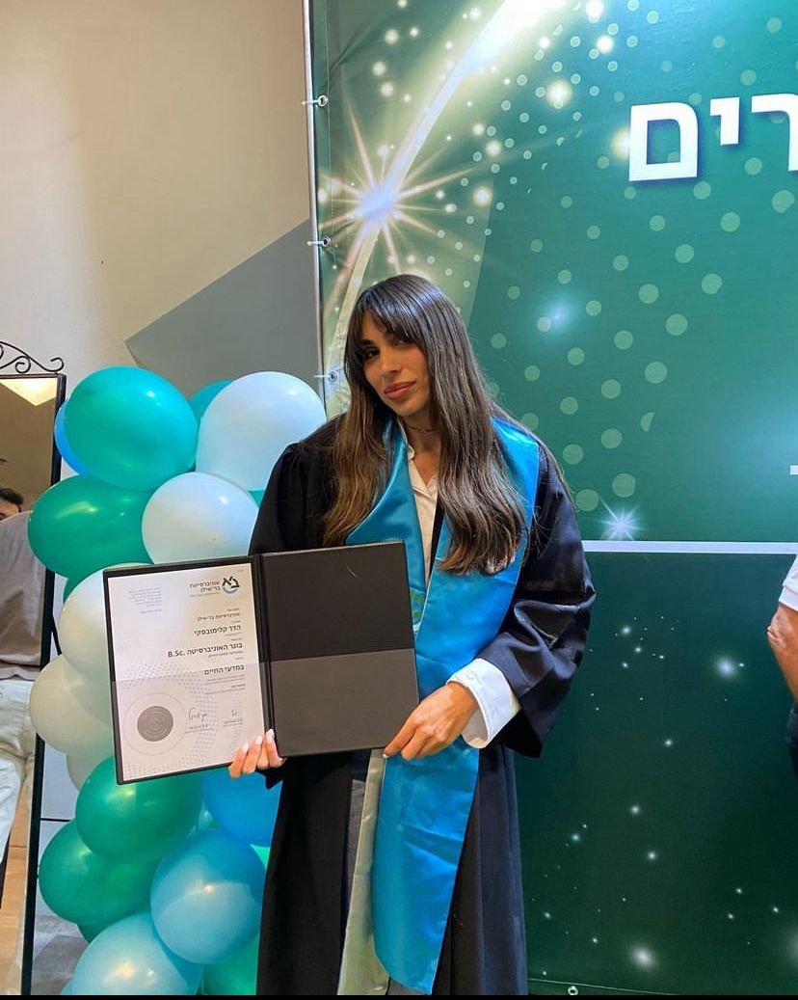

# HadarKlimovski.github.io

My name is Hadar, and I am a MSc student at the Weizmann Institute of Science.

My research focuses on the vaginal microbiome and its correlation with age, BMI, menopause status, and nutrition.
I am doing this project as part of [Eran Segal's](https://www.weizmann.ac.il/math/segal/) lab at the Weizmann Institute of Science. 

As part of my MSc I took a Python course, where I learned to make this website in github.
If you want to create a page on github also click on the following link for more information:[python course](/pyhthon)
I recommend you to view in [Meir Sylman's page ](https://meirsylman.github.io/), my friend from this course, Its great!
