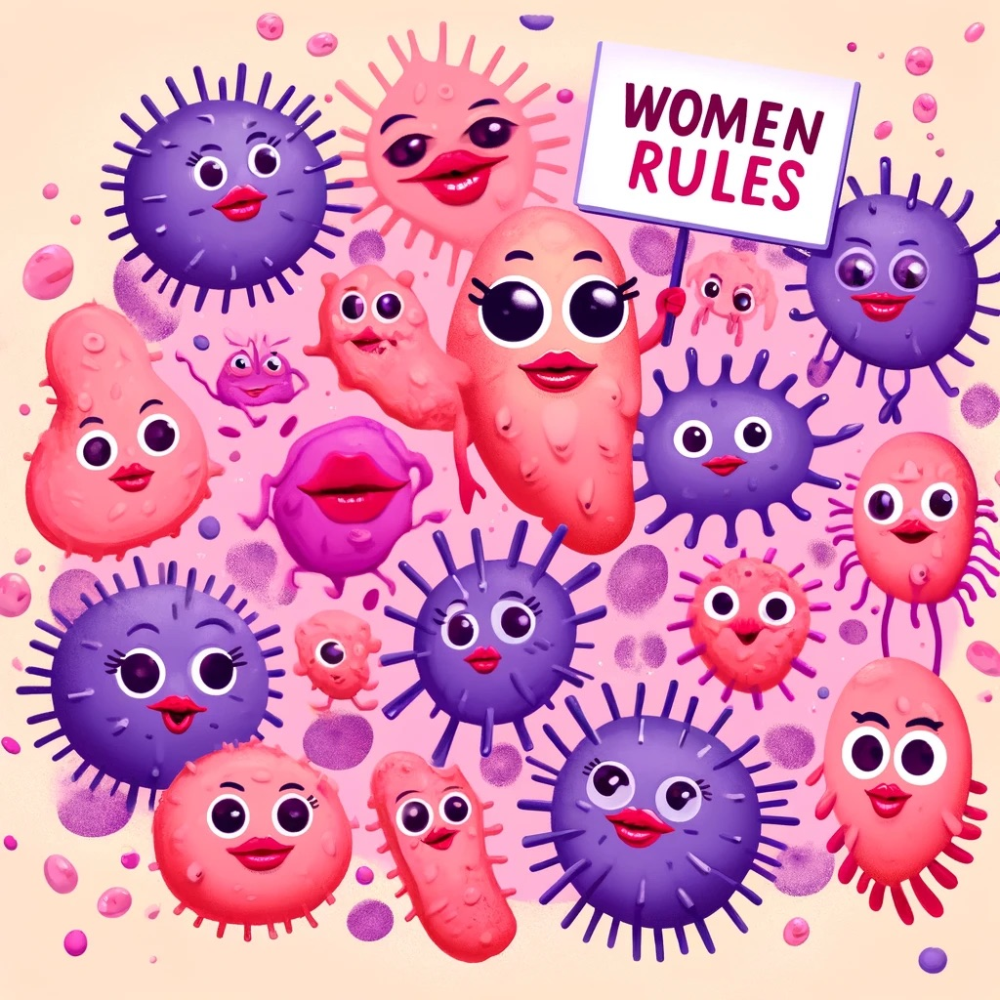

# Data scientist 

### Education
- B.Sc. in Life science, Bar Ilan University, Ramat Gan, Israel.
- M.Sc student in life sciences, Weizmann Institue of science, Israel.

### My reserch project
My research focuses on the vaginal microbiome and its correlation with age, BMI, menopause status, and nutrition.
I am doing this project as part of [Eran Segal's](https://www.weizmann.ac.il/math/segal/) lab at the Weizmann Institute of Science. 

### Python course 2024
- As part of my MSc I took a Python course, where I learned to make this website in github.
- If you want to create a page on github also click on the following link for more information -> [python course](/python).
- If you want to improve your python programming skills you can view my [assigmnets](https://github.com/HadarKlimovski/HadarsAssignments/tree/main).
- I recommend you to view in [Meir Sylman's page ](https://meirsylman.github.io/), my friend from this course, Its great!

